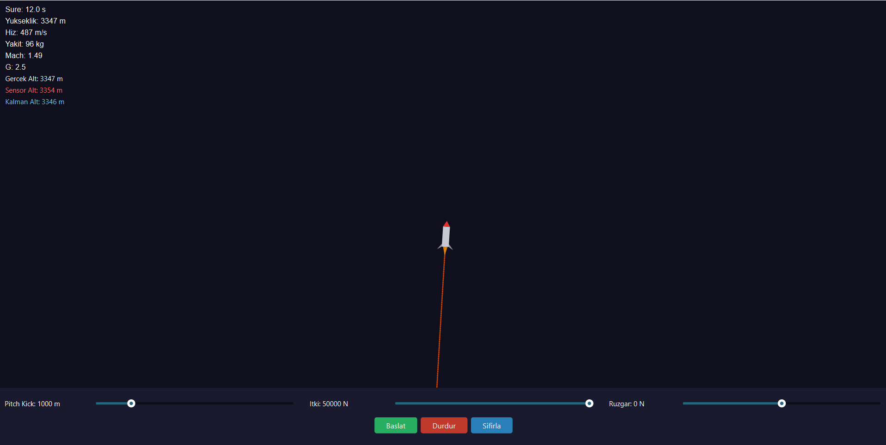

# 🚀 2D Rocket Simulator

This repository contains the initial 2D proof-of-concept (POC) for the rocket trajectory simulation. It served as a baseline to study basic kinematic relations and Euler integration. The project has now evolved into Phase 2: a pure C++, 3D 6-DOF engine using RK4 integration. 

C++ ve Qt6 kullanılarak geliştirilmiş, gerçekçi fizik hesaplamalarına dayalı bir **2D Roket Yörünge Simülatörü**.

## 1. Mathematical Model (Matematiksel Model)

Simülasyon, roketin hareketini aşağıdaki **Diferansiyel Denklem Sistemi** ile modeller:

### Durum Vektörü (State-Space Representation)
Sistemin durumu 5 değişkenli bir vektörle tanımlanır:
$$\mathbf{x} = [x, y, v_x, v_y, m]^T$$
Burada $(x, y)$ konum, $(v_x, v_y)$ hız ve $m$ anlık kütledir.

### Kuvvet Dengesi (Force Balance)
Rokete etki eden toplam kuvvet:
$$\mathbf{F}_{total} = \mathbf{F}_{thrust} + \mathbf{F}_{drag} + \mathbf{F}_{gravity}$$

- **Thrust:** Motorun bakış açısına (thrustAngle) göre yönlendirilmiş itki.
- **Drag:** $F_{drag} = \frac{1}{2} \rho C_d A v^2$ (Hava yoğunluğu $\rho$, irtifaya bağlı olarak eksponansiyel değişir).
- **Gravity:** Yerçekimi sabit kabul edilmemiş, Newton'un Evrensel Çekim Yasası uyarınca irtifaya göre güncellenmektedir: $g(h) = g_0 \left(\frac{R}{R+h}\right)^2$.

### Değişken Kütle (Tsiolkovsky Equation)
Yakıt tüketimi, motor verimliliği (ISP) ve itki kuvvetine bağlı olarak her adımda güncellenir:
$$\dot{m} = -\frac{F_{thrust}}{I_{sp} \cdot g_0}$$

## 2. Numerical Integration (Sayısal İntegrasyon)

Simülasyonda diferansiyel denklemlerin çözümü için **Simple Euler** yöntemi kullanılmaktadır:
- $v_{t+dt} = v_t + a \cdot dt$
- $p_{t+dt} = p_t + v \cdot dt$

*Not: Euler yöntemi düşük doğruluklu bir integrasyon türüdür (O(dt)). Gelecek sürümlerde enerji korunum hatasını minimize etmek için 4. Derece Runge-Kutta (RK4) yöntemine geçilmesi planlanmaktadır.*

## 3. Physics Assumptions (Fiziksel Kabuller)

Mühendislik dürüstlüğü adına, simülasyondaki mevcut basitleştirmeler şunlardır:
- **Flat Earth:** Dünya yüzeyi düz kabul edilmiştir (Kavis ihmal edilmiştir).
- **Constant Cd:** Atmosferik sürüklenme katsayısı ($C_d$) Mach sayısından bağımsız olarak sabit kabul edilmiştir.
- **Coriolis Force:** Dünyanın kendi ekseni etrafındaki dönüşünden kaynaklanan Coriolis kuvveti ihmal edilmiştir.
- **No Aerodynamic Moments:** Roket bir nokta kütle gibi düşünülmüş, aerodinamik momentler ve kararlılık (center of pressure vs center of gravity) hesaba katılmamıştır.

## 4. Verification (Doğrulama)

Simülasyonun doğruluğu, vakum ortamındaki (hava dirençsiz) dikey atış formülleri ($h = v_0 t - \frac{1}{2} g t^2$) ile karşılaştırılarak test edilmiştir. Mevcut Euler entegrasyonu $dt = 0.016s$ adım aralığında yörünge takibi için kabul edilebilir bir hata payı dahilindedir.

---

## 🛠️ Kurulum

### Gereksinimler

- **Qt 6.x** (Widgets ve Core modülleri)
- **CMake 3.19+**
- **C++17 Standartı** uyumlu bir derleyici (MSVC, GCC veya Clang)

### Derleme adımları

1. Bu depoyu klonlayın: `git clone https://github.com/KULLANICI_ADIN/RocketSimulator.git`
2. Bir build klasörü oluşturun: `mkdir build && cd build`
3. CMake'i çalıştırın: `cmake ..`
4. Projeyi derleyin: `cmake --build .`
